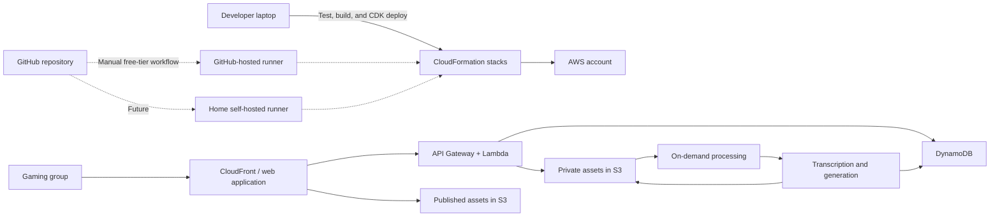

# Panther AWS Platform Architecture

Status: Early draft

## Purpose

This document describes the initial cloud architecture for Panther. It focuses on establishing
low-cost AWS infrastructure for storing game assets now, while leaving a clear path to a private,
group-facing web application and on-demand transcript processing later.

Application code and infrastructure code are maintained in GitHub. Application data and game
assets live in a dedicated AWS account and are never stored in the application repository.

## Primary Requirements

- Use one dedicated AWS account for the Panther application and its game data.
- Treat GitHub as the source of truth for application and infrastructure code.
- Define infrastructure as code using AWS CDK.
- Use local laptop checks and deployments initially; automatic CI is not required for the baseline.
- Allow manually triggered GitHub-hosted CI within the free tier when it is materially useful.
- Prefer computers owned by the project owner for future routine CI/CD compute.
- Support private group collaboration and selectively published web content.
- Support open-ended asset types without changing the S3 hierarchy for each new type.
- Preserve original recordings and generated artifacts independently of application deployments.
- Keep idle cost close to zero. Small ongoing charges for retained storage, DNS, and domain
  registration are acceptable.
- Avoid always-on infrastructure unless a later requirement clearly justifies it.

## Scope and Tenancy

The initial deployment supports one gaming group and one game.

Panther will not initially implement general-purpose multi-tenancy. In particular, it will not
provide tenant billing, tenant administration, per-tenant infrastructure, or adversarial tenant
isolation.

The data model and object paths should still carry a `game_id`. This is a low-cost precaution that
allows another game to be added later without redesigning storage. It does not make the initial
application multi-tenant.

## High-Level Architecture



## AWS Services

### Asset storage

Amazon S3 is the durable source of truth for uploaded and generated files.

- A private asset bucket holds source documents, raw recordings, working transcripts, and other
  group-only material.
- A published asset bucket holds only explicitly approved web media and exports.
- Public access is blocked on the private bucket.
- Published content is served through CloudFront rather than directly exposing the bucket.
- Versioning and lifecycle policies protect important files while controlling long-term cost.
- Default S3 encryption is used initially. A customer-managed KMS key is not required for the first
  deployment.

Asset keys are organized around stable asset identities, not a fixed list of media types. An asset
can have an original and any number of derived representations:

```text
games/<game-id>/assets/<asset-id>/original/<filename>
games/<game-id>/assets/<asset-id>/derived/<representation-id>/<filename>
games/<game-id>/assets/<asset-id>/manifests/<version>.json
games/<game-id>/sessions/<session-id>/manifests/<version>.json
```

The private bucket contains canonical originals and working derivatives. The published bucket uses
the same game and asset identifiers, but contains only representations deliberately approved for
web access.

Each asset has metadata in the application database and, where useful, a portable JSON manifest.
Metadata includes `asset_id`, `game_id`, optional `session_id`, title, open-ended `asset_kind`, MIME
type, visibility, tags, relationships, provenance, checksum, and available representations.
`asset_kind` is a namespaced string rather than a closed enumeration, allowing new kinds to be
introduced without an infrastructure or schema migration.

Examples of assets and representations that fit this model:

| Asset | Possible original | Possible derived representations |
|---|---|---|
| Portrait | PNG, JPEG, or source project | WebP, thumbnail, cropped avatar |
| Generated video | Source video and generation metadata | Web MP4, poster image, captions |
| Transcript | Timestamped JSON | Markdown, HTML, subtitles, searchable text |
| Music | WAV, FLAC, or licensed source | Streaming format, preview, waveform |
| Map | Image, PDF, or native source | Web image, thumbnail, tiles |
| Game document | PDF or native document | Preview images, extracted text |
| Narrative story | Markdown or structured text | HTML, PDF, ebook, narrated audio |

This list is illustrative, not exhaustive. Collections, sessions, characters, locations, and other
domain concepts refer to asset IDs rather than relying on asset placement in type-specific folders.
Native or licensed game artifacts are private by default.

### Application data

DynamoDB on-demand is the default database choice for sessions, speakers, artifact metadata,
transcript state, and lightweight collaboration data. It has no provisioned database server and is
well suited to the near-zero-idle-cost requirement.

If relational querying becomes important, Aurora Serverless v2 PostgreSQL with automatic pause at
zero capacity is the preferred alternative. A conventional always-on RDS instance is not part of
the initial design.

### Web application and access

- CloudFront and a private S3 site bucket serve the initial group-facing media explorer.
- Cognito provides invited-user authentication with self-registration disabled.
- API Gateway and Lambda provide a read-only media API protected by a Cognito JWT authorizer.
- Private files are accessed through short-lived signed URLs.
- Published files are deliberately promoted to the published asset bucket.

The initial explorer can navigate the private `games/` hierarchy and preview files. It intentionally
does not upload, delete, rename, or publish assets. Those operations will first be introduced through
the Panther CLI and can later be added to the web application with explicit authorization rules.

The first two Cognito users are provisioned by a CDK custom resource. It creates strong passwords at
deployment time and stores them as SSM SecureString parameters; plaintext passwords never enter Git,
CDK context, CloudFormation outputs, or Lambda logs. The custom resource exists because
CloudFormation cannot model a Cognito user's permanent password or an SSM SecureString value. It runs
only during stack lifecycle operations.

### Processing

Transcription and media generation run only when work exists.

- S3 events and queues initiate processing.
- Step Functions may coordinate longer workflows.
- Lambda handles short orchestration and transformation steps.
- AWS-managed transcription or on-demand container tasks handle longer processing.
- No worker fleet remains running between sessions.

The exact transcription provider is intentionally left open by this platform architecture.

## Near-Zero Idle Cost Design

The initial platform must not require:

- A NAT Gateway
- Always-on EC2 instances
- An always-running ECS service
- An Application Load Balancer
- A conventional provisioned RDS database
- Provisioned Lambda concurrency
- Unnecessary VPC interface endpoints

The preferred services—S3, CloudFront, Cognito, API Gateway, Lambda, DynamoDB on-demand, queues, and
Step Functions—charge primarily for retained data or actual use.

At no activity, expected costs should consist mainly of:

- S3 storage for retained assets
- Route 53 hosted-zone and domain charges, if used
- Small amounts of retained logs, backups, or deployment artifacts

AWS Budgets and billing alerts must be configured during account setup. Resources should carry
project, environment, and cost-center tags. Log retention and S3 lifecycle rules must be explicit.

## Infrastructure as Code

### Decision: AWS CDK

AWS CDK is the selected implementation. It keeps infrastructure alongside the application in
GitHub and deploys standard CloudFormation stacks. Other infrastructure frameworks are not planned
for the initial deployment.

TypeScript is the recommended CDK language because it has the broadest examples and construct
ecosystem. Python CDK is also reasonable if using one language across the project is more valuable.

Suggested repository layout:

```text
infra/
  bin/
  lib/
  test/
src/
docs/
```

Suggested stack boundaries:

- `PantherFoundationStack`: storage, budgets, shared naming, and deployment access
- `PantherWebStack`: web hosting, authentication, and API
- `PantherProcessingStack`: queues, workflows, and on-demand processing

Console-created application resources are not authoritative and must be captured in CDK. Manual
account creation, root-user security, the first CDK bootstrap, and enabling organization-level IAM
Identity Center are documented exceptions because AWS does not expose those operations through
CDK. Installing and registering a future physical home runner will also be documented as a manual
machine-bootstrap step.

## Continuous Integration and Delivery

### Decision: Local first; automated CI deferred

The initial workflow uses laptop compute for tests, builds, CDK synthesis, infrastructure review,
and deployment. Automatic CI is intentionally disabled while the baseline infrastructure is being
established. Avoiding CI is preferable when local checks provide adequate confidence.

The GitHub Actions workflow is manually triggered and uses the GitHub-hosted free tier. It is a
temporary fallback for cases where remote CI adds meaningful value, not a required step for every
pull request.

The delivery paths are:

1. **Laptop:** The normal path. Run checked-in scripts directly, authenticate with short-lived AWS
   credentials, inspect `cdk diff`, and deploy manually.
2. **Manual GitHub-hosted workflow:** Use the GitHub free tier only when CI is specifically useful.
3. **Future home self-hosted runner:** Add routine automated CI/CD later using project-owned compute.
4. **CodeBuild on demand:** Retain only as an optional future fallback; do not deploy it initially.

When a home runner is eventually introduced, it should be repository-scoped and isolated from
general-purpose personal use. GitHub will coordinate jobs while the owned machine performs the
compute. Slow or delayed builds are acceptable in exchange for avoiding hosted compute cost.

If CodeBuild is introduced later, Lambda compute mode is appropriate for checks that finish within
15 minutes and do not require Docker. CodePipeline is not required.

All build commands live in the repository and behave the same locally, in the manual GitHub
workflow, and on any future home runner.

## Delivery and Security

- Manual GitHub Actions deployments use OIDC to obtain short-lived AWS credentials for a narrowly
  scoped deployment role. Long-lived AWS access keys are not stored in GitHub.
- Laptop deployments use short-lived AWS credentials.
- Pull requests are verified locally unless the manual GitHub workflow is explicitly started.
- A future home runner will be repository-scoped, isolated, and restricted to trusted workflows.
- Deployment roles follow least privilege and are separate from normal user access.
- The AWS root user has MFA and no access keys.
- Administrative access uses short-lived credentials.
- Private buckets block all public access.

## Initial Foundation Milestone

The first milestone is deliberately small. It enables asset uploads without committing to the
complete web application.

The operational procedure is maintained in [aws-foundation-runbook.md](aws-foundation-runbook.md).

1. Create the dedicated AWS account and secure root recovery access.
2. Use `us-west-2` as the primary AWS region and establish billing alerts. Global AWS resources are
   the only default exception; any additional-region resource requires an explicit, documented
   reason.
3. Bootstrap CDK and deploy a one-account AWS Organization from the laptop.
4. Enable organization-level IAM Identity Center in the console, then deploy its user and restricted
   administration and asset-uploader permission sets with CDK. Defer the
   GitHub OIDC provider and deployment role until remote deployment is actually needed.
5. Deploy the private and published S3 buckets with encryption, versioning, and lifecycle rules.
6. Verify an authenticated command-line upload to the private bucket.

Database tables and processing services can follow in later milestones. They are not required before
uploading or browsing the first assets.

## Initial Media Explorer Milestone

The first read-only explorer adds:

1. A private S3 bucket and CloudFront distribution for the static web application.
2. A Cognito user pool with self-registration disabled and two CDK-managed users.
3. An HTTP API with JWT authorization and an on-demand Lambda reader for private assets.
4. Five-minute S3 links for in-browser media previews.

It adds no VPC, NAT Gateway, EC2 instance, load balancer, database, or always-running service.

## Domain and DNS

The primary application domain is `panther.place`. Route 53 domain registration is an unavoidable
manual API operation because CloudFormation and CDK do not support domain registrations. Route 53
also creates a temporary public hosted zone as a side effect. Panther creates its authoritative
hosted zone in the `PantherDomain` CDK stack; after registration completes, the registrar is pointed
at the CDK zone's name servers and the unused temporary zone is removed. This one-time registrar
coordination is the only DNS step outside CDK. All records are managed in CDK.

The hosted zone and CloudFront certificate are anchored in `us-east-1`. This is a documented
exception to Panther's `us-west-2` default because ACM certificates used by CloudFront must be in
`us-east-1`. Regional application services remain in `us-west-2`.

## Deferred Decisions

- DynamoDB access patterns and table design
- Web framework and hosting choice between Amplify and S3/CloudFront
- Transcription provider and processing runtime
- Retention periods for raw audio and intermediate artifacts
- Backup and disaster-recovery targets
- Rules governing promotion from private to published content
- Home-runner hardware, operating system, and isolation method

## Relevant AWS Documentation

- [Amazon S3 pricing](https://aws.amazon.com/s3/pricing/)
- [Amazon VPC pricing](https://aws.amazon.com/vpc/pricing/)
- [AWS Lambda pricing](https://aws.amazon.com/lambda/pricing/)
- [Amazon API Gateway pricing](https://aws.amazon.com/api-gateway/pricing/)
- [Amazon DynamoDB on-demand pricing](https://aws.amazon.com/dynamodb/pricing/on-demand/)
- [Aurora Serverless v2 automatic pause](https://docs.aws.amazon.com/AmazonRDS/latest/AuroraUserGuide/aurora-serverless-v2-auto-pause.html)
- [Amazon Cognito pricing](https://aws.amazon.com/cognito/pricing/)
- [AWS CodeBuild pricing](https://aws.amazon.com/codebuild/pricing/)
- [CodeBuild builds using Lambda compute](https://docs.aws.amazon.com/codebuild/latest/userguide/lambda.html)
- [CodeBuild GitHub webhook events](https://docs.aws.amazon.com/codebuild/latest/userguide/github-webhook.html)
- [GitHub self-hosted runners](https://docs.github.com/en/actions/hosting-your-own-runners/managing-self-hosted-runners/about-self-hosted-runners)
